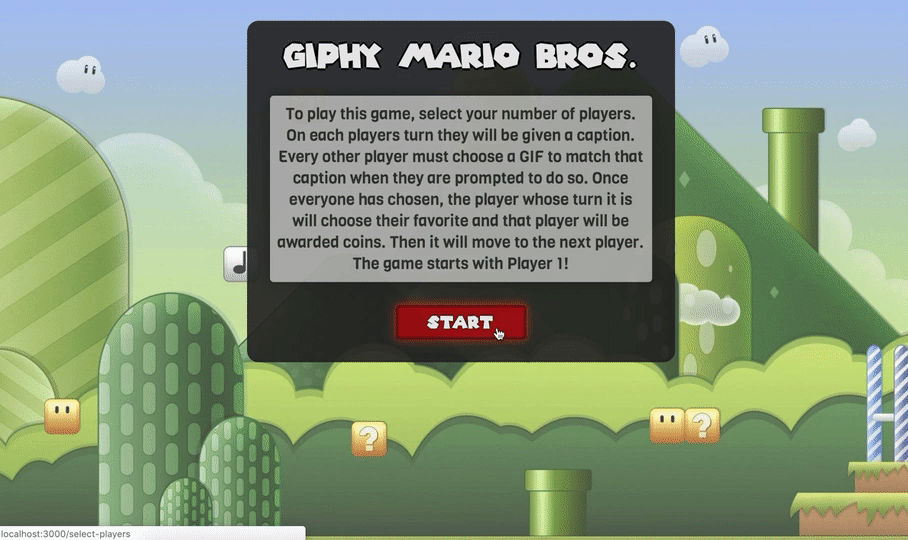
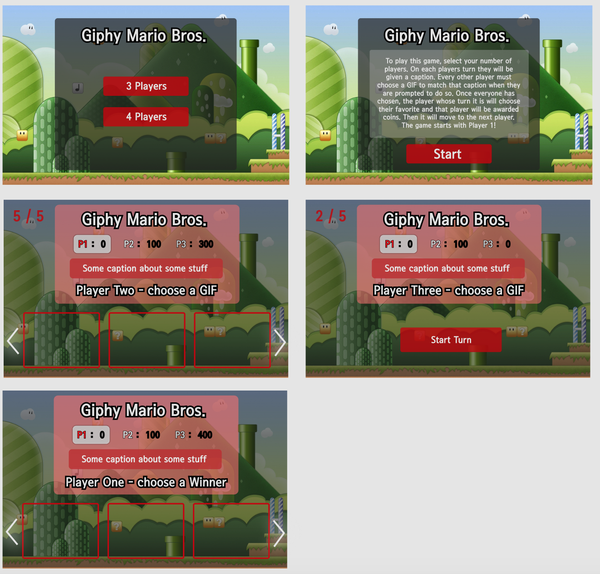

# Giphy Mario Bros.

### Abstract 

This project was assigned with a user group and an API, with the goal of building an app using the API to suit the needs of that user group. The user group for this app was 'gamers' and the API was the Giphy API. So, I decided to build a game along the lines of Cards Against Humanity or What Do You Meme? but using all Mario-themed GIFs instead. The project is built using React/Redux, as well as React Router, Sass, Jest/Enzyme for testing, and Thunk middleware.

### Installation & Set Up

```
git clone https://github.com/jarushford/giphy-mario-bros.git

cd giphy-mario-bros

npm install

```

To run this app you will need to apply for an API key [here](https://developers.giphy.com/). Once you have done this, put the key in a file called apiKey.js in the utils directory:

```
-> export const apiKey = 'Your API Key'

Run npm start and visit localhost:3000 in your browser

```




#### Original Wireframes



#### Author

- Jamie Rushford
  - https://github.com/jarushford
